# mivo-model-viewer

**尽量支持多格式的浏览器端 3D 模型查看器 SDK**，可方便地嵌入各种前端页面。

基于 TypeScript + Three.js：默认提供完整可交互 UI，也支持按面板裁剪主题，或关掉 UI 只用无头引擎自绘界面。已发布至 npm。

```bash
npm install mivo-model-viewer three
```

| | |
|---|---|
| npm | [`mivo-model-viewer`](https://www.npmjs.com/package/mivo-model-viewer) |
| Live Demo | GitHub Pages（本仓库 Actions 自动部署） |
| License | MIT |

---

## 为什么是它

在业务页里预览模型时，常见诉求是：

- 用户丢进来的文件格式杂（GLB / FBX / ZIP 资源包…）
- 不想为每个项目重写一套查看器 UI
- 又希望 UI 能贴合宿主产品（隐藏按钮、换主色、中英文）
- 更极端时只要 Canvas + API，界面完全自己做

`mivo-model-viewer` 把这些收成一条安装命令、一个工厂函数：

```ts
import { createModelViewer } from 'mivo-model-viewer'

const viewer = createModelViewer('#app', {
  locale: 'zh-CN',
  theme: { primary: '#745ef5' }
})

// 内置「导入」按钮即可选文件；也可程序化加载
// await viewer.load(file)
```

容器需要有明确高度：

```html
<div id="app" style="width:100%;height:100vh"></div>
```

---

## 支持格式

| 类型 | 格式 | 说明 |
|------|------|------|
| 模型 | **GLB / GLTF / OBJ / FBX / STL / PLY / DAE / 3MF / 3DS** | 浏览器内直接解析 |
| 资源包 | **ZIP** | 内含模型 + 贴图时自动选入口、映射路径 |
| 暂不支持 | VRML、STEP 等 CAD | 建议先转为 GLB / OBJ 再导入 |

**ZIP + 材质策略（明确边界）**

1. 解压 ZIP → 自动选入口模型（浅路径优先，glb/gltf > fbx > obj > 3ds…）
2. LoadingManager 把相对路径映射到包内资源（`textures/`、`fbm/`、同目录等）
3. FBX / OBJ / 3DS / DAE：Loader 缺贴图时按 basename + 关键词（diffuse / normal / rough / metal…）补全
4. OBJ 尝试解析包内简易 MTL（Kd / map_Kd）
5. 仍缺失：回落默认 PBR，并在 UI「材质」中显示状态

**不会承诺**：任意 FBX 100% 还原、原生 VRML、服务端 CAD 转换。

---

## 接入方式

### 1. 默认 UI（推荐起步）

```ts
import { createModelViewer } from 'mivo-model-viewer'

const viewer = createModelViewer(document.getElementById('view')!, {
  locale: 'zh-CN',              // 'zh-CN' | 'en-US'
  theme: {
    primary: '#3b82f6',
    panelBg: 'rgba(20,20,24,0.94)',
    background: 'linear-gradient(180deg,#0f172a,#1e293b)'
  },
  ui: {
    // 均默认 true；按需关掉
    infoPanel: true,            // 左侧：模型信息
    settingsPanel: true,        // 右侧：显示 + 灯光
    toolbar: true,
    import: true,
    export: false,              // 例：宿主不需要导出
    screenshot: true,
    textureModes: true,
    toasts: true
  },
  onReady: (s) => console.log('ready', s.fileName),
  onLoadError: (e) => console.error(e),
  onStateChange: (s) => { /* 驱动你自己的状态栏 */ }
})

viewer.dispose() // 路由离开时释放 WebGL / DOM / 监听
```

主题通过根节点 CSS 变量生效：`--mv-primary`、`--mv-text`、`--mv-panel-bg`、`--mv-bg`。

### 2. 无头模式（完全自定义 UI）

```ts
import { createModelViewer } from 'mivo-model-viewer'

const viewer = createModelViewer('#viewport', { ui: false })

viewer.subscribe((state) => {
  // 用自己的侧栏 / 工具条渲染 state
})
viewer.setProjection('orthographic')
viewer.setPresetView('front')
viewer.setTextureMode('clay')
await viewer.load(file)
```

### 3. 仅引擎（`./core` 子路径）

```ts
import { ViewerEngine, isSupportedModelFile } from 'mivo-model-viewer/core'

const engine = new ViewerEngine(container)
await engine.loadFromFile(file)
const png = await engine.captureScreenshot()
engine.dispose()
```

### 3. 离屏出图：模型 → 图片

不打开默认 UI，把模型渲染成 Blob / data URL（缩略图、分享图、审核快照）。

```ts
import { renderModelImage, renderModelImages } from 'mivo-model-viewer/core'

// 只传 model 即可出图（其余全默认）
// 默认：1024×1024 PNG、透明底、透视、front、无网格、贴图模式自动
const blob = await renderModelImage({ model: file }) // 或 URL 字符串

// 按需覆盖
const styled = await renderModelImage({
  model: file,
  width: 1280,
  height: 800,
  format: 'png',               // png | jpeg | webp
  background: 'transparent',   // jpeg 默认白底
  presetView: 'front',         // front | back | side | top
  lightIntensity: 3,
  square: false                // true 时按长边裁成 1:1
})

// 多机位一次出图
const shots = await renderModelImages({
  model: 'https://example.com/chair.glb',
  width: 1024,
  views: ['front', 'side', 'top'],
  format: 'webp',
  quality: 0.9
})
```

| 选项 | 说明 |
|------|------|
| `model` | `File` \| `Blob` \| URL 字符串 |
| `width` / `height` | 输出像素，默认 1024×1024 |
| `format` / `quality` | `png` \| `jpeg` \| `webp`；有损格式用 quality 0–1 |
| `background` | `'transparent'` 或 CSS 颜色；jpeg 默认 `#ffffff` |
| `presetView` / `views` | 单机位 / 多机位批量 |
| `projection` | `perspective` \| `orthographic` |
| `textureMode` | `textured` \| `clay` \| `normal` \| `albedo` |
| `lightAngle` / `lightIntensity` / `ambientIntensity` | 灯光 |
| `square` | 长边 1:1 裁切 |
| `showGrid` | 是否画参考网格，默认关 |
| `signal` | `AbortSignal` 可取消 |

返回值：`renderModelImage` → `Blob`；`renderModelImages` → `{ blob, width, height, format, view, fileName }[]`。

---

## API 暴露方式

包提供 **两个入口**，都是 ESM + TypeScript 类型：

| 入口 | 内容 | 典型场景 |
|------|------|----------|
| `mivo-model-viewer` | `createModelViewer` 默认 UI 组件 + core 导出 | 业务页快速嵌入 |
| `mivo-model-viewer/core` | 仅 `ViewerEngine` / `ModelLoader` / 工具函数 | 自定义 UI、微前端、设计工具 |

### 工厂函数

```ts
createModelViewer(
  container: HTMLElement | string,
  options?: ModelViewerOptions
): ModelViewerInstance
```

**`ModelViewerOptions`（节选）**

| 字段 | 类型 | 说明 |
|------|------|------|
| `src` | `File \| Blob` | 挂载后自动加载 |
| `ui` | `boolean \| ModelViewerUIOptions` | `true` 全开 / 对象按面板开关 / `false` 无头 |
| `theme` | `{ primary, text, panelBg, background }` | CSS 变量级换肤 |
| `locale` | `'zh-CN' \| 'en-US'` | 默认 UI 文案 |
| `defaults` | `{ lightIntensity, ambientIntensity }` | 灯光初值 |
| `onStateChange` | `(state: ViewerState) => void` | 状态订阅 |
| `onReady` / `onLoadError` / `onFileRejected` | callback | 生命周期 |

**`ModelViewerInstance`（实例方法）**

| 成员 | 说明 |
|------|------|
| `load(File \| Blob)` | 加载模型 |
| `subscribe(fn)` | 订阅状态，返回取消函数 |
| `setProjection('perspective' \| 'orthographic')` | 投影切换 |
| `setPresetView('front' \| 'back' \| 'side' \| 'top')` | 预设机位（球面插值动画） |
| `setTextureMode('textured' \| 'clay' \| 'normal' \| 'albedo')` | 贴图显示模式 |
| `setLightIntensity` / `setAmbientIntensity` / `setLightAngle` | 灯光 |
| `captureScreenshot(): Promise<Blob>` | 1:1 PNG |
| `exportModel(): Blob \| null` | 导出源文件 |
| `dispose()` | 释放资源 |
| `engine` | 底层 `ViewerEngine` 逃生舱 |
| `root` / `state` | 根节点与当前状态 |

**`ViewerEngine`（core，UI 无关）**

| 成员 | 说明 |
|------|------|
| `loadFromFile(file)` | 解析并挂载模型 |
| `subscribe` / `state` | 状态发布订阅 |
| `toggleProjectionMode` / `setPresetView` / `applyTextureMode` | 视图；`setPresetView(v, { animate: false })` 可瞬时定位 |
| `setLightAngle` / `setLightIntensity` / `setAmbientIntensity` | 灯光 |
| `renderToBlob({ format, quality, square, showGrid })` | 灵活出图 |
| `captureScreenshot()` | 1:1 PNG（等价 `renderToBlob({ square: true })`） |
| `setRenderSize(w, h)` / `setBackground(color \| 'transparent')` | 离屏尺寸与底色 |
| `exportCurrentModel` / `setGridVisible` / `hasValidModel` / `dispose` | 导出与销毁 |

**工具与常量（core）**  
`isSupportedModelFile` · `SUPPORTED_ACCEPT` · `CAMERA_CONFIG` · `countTriangles` · `getModelDiagonal` · `hasValidModelDimensions` · `disposeObject3D` · `calculateOrthographicViewSize` · `sphericalToCartesian` · `extractAlbedoFromMaterial`

**离屏出图（core）**  
`renderModelImage` · `renderModelImages` · `renderModelImageDetailed` · `renderModelImageObjectURL` · `renderModelImageDataUrl` · `resolveModelInput`

**稳定枚举**

```ts
type ProjectionMode = 'perspective' | 'orthographic'
type PresetView = 'front' | 'back' | 'side' | 'top' | 'none'
type TextureMode = 'textured' | 'clay' | 'normal' | 'albedo'
type Locale = 'zh-CN' | 'en-US'
```

---

## 架构

两层拆分：**core 引擎** 与 **默认 UI 组件**。宿主可以只碰 UI 配置，也可以穿透到引擎。

```mermaid
flowchart TB
  subgraph Host["宿主页面"]
    Page["任意前端页面<br/>Vue / React / 原生 / 微前端"]
  end

  subgraph SDK["mivo-model-viewer"]
    Factory["createModelViewer()"]
    UI["默认 UI 层<br/>面板 / i18n / theme / toast"]
    API["ModelViewerInstance<br/>load · subscribe · set* · dispose"]

    subgraph Core["core（可独立引用）"]
      Engine["ViewerEngine<br/>相机 · 灯光 · 轨道控制 · 状态机"]
      Loader["ModelLoader<br/>多格式 + ZIP 资源包"]
      Pack["AssetPack / MaterialResolver<br/>路径映射 · 材质补全"]
    end
  end

  Three["three.js (peerDependency)"]
  Files["GLB GLTF OBJ FBX STL<br/>PLY DAE 3MF 3DS ZIP"]

  Page --> Factory
  Factory --> UI
  Factory --> API
  UI --> Engine
  API --> Engine
  Engine --> Loader
  Loader --> Pack
  Loader --> Three
  Engine --> Three
  Files --> Loader
```



**设计要点**

| 点 | 说明 |
|----|------|
| UI / Engine 分离 | `ui: false` 或 `model-viewer-core` 入口即可只要画布与状态机 |
| 配置即扩展点 | 面板开关、主题变量、locale、回调，宿主不必 fork 组件 |
| 逃生舱 | `instance.engine` 直接调 Three.js 层能力 |
| peerDependency | `three` 由宿主安装，避免多实例 |
| CSS 作用域 | 样式挂在 `.mv-root`，变量可覆盖，不污染宿主全局 |
| 资源释放 | `dispose()` 撤销 RAF、resize、DOM、WebGL、模型材质 |

**状态流**

```text
用户操作 / load()
        │
        ▼
  ViewerEngine.patch(state)
        │
        ├──► 默认 UI render(state)
        ├──► options.onStateChange
        └──► instance.subscribe
```

---

## 在业务页中的典型嵌入

| 场景 | 用法 |
|------|------|
| 资产库 / 作品详情 | 默认 UI，`ui.export = false`，主题对齐设计系统 |
| 审核后台 | 默认 UI + `onStateChange` 同步审核侧栏 |
| 配置器 / 编辑器 | `ui: false`，自绘工具条，调用 `set*` API |
| 设计系统文档站 | 固定 `src`，只读展示 + 截屏下载 |
| 列表缩略图 / 分享卡片 | `renderModelImage({ model, views: ['front'], square: true })` |
| 后台批量导出预览 | `renderModelImages({ model, views: ['front','side','top'] })` |

---

## 开发

```bash
npm install
npm run dev          # Demo 查看器 → http://localhost:5174
npm run typecheck
npm run build        # npm 库产物 → dist/
npm run build:pages  # GitHub Pages 站点 → dist-demo/
```

仓库结构：

```text
src/
  core/           # 无 UI 引擎（ViewerEngine / ModelLoader / …）
  ui/             # 默认 UI 组件（createModelViewer）
  index.ts        # 包主入口
src/main.ts       # Demo 入口（进 Pages，不进 npm 包）
.github/workflows/deploy-pages.yml
```

GitHub Pages：推送到 `main` 后由 Actions 构建 Demo 并部署（站点路径 `/modelviewer/`）。

---

## 发布

包已发布：`mivo-model-viewer@0.1.0`（账号 `miragari`）。

```bash
npm run build
npm pack --dry-run
npm publish
```

破坏性 API 变更请升 major；`three` 保持 peer 范围兼容。

---

## License

MIT
